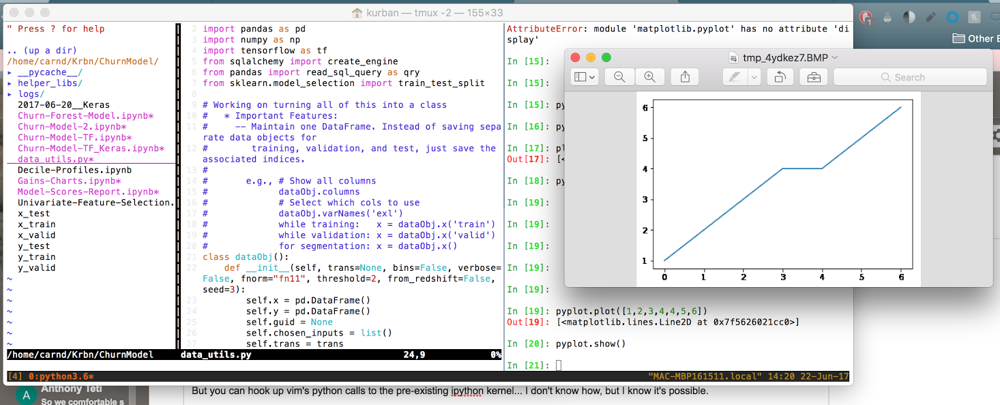

## On connecting local QTConsole to iPython on AWS...

Found some help [here](https://stackoverflow.com/questions/32279351/connect-to-remote-kernel-on-aws-using-local-qtconsole)...  
1. Instead of "jupyter qtconsole", you can do "jupyter console" on the remote instance.  

There is a whole section on SSH tunnels on the IPython QTConsole docs page:
https://qtconsole.readthedocs.io/en/stable/

This guys seems to have nailed the solution:
https://rsb.io/posts/ripkern-remote-ipython-kernels/


====================================
LOCAL SOL'N

Here is another read-the-docs page that is helpful:
http://jupyter-notebook.readthedocs.io/en/latest/examples/Notebook/Connecting%20with%20the%20Qt%20Console.html

```
jupyter console
%connect_info   # this will not work in ipython instance; must use jupyter console instance
# 3 ways to do this 
#   a. copy json output into fileName, then: jupyter <app> --existing <fileName>
#   b. if both connections to kernel are local:  jupyter <app> --existing kernel-87574.json
#   c. more simply, if you're simply trying to connect to most recent kernel instance:  jupyter <app> --existing
#
# test it
jupyter console
%connect_info
a=2
# in new Bash terminal
jupyter qtconsole --existing 
a
# Does it output 2?
#### YES!  Nice.
# NOTE: if you exit original jupyter console, everything dies (w/ notification)
```
==========================================

This guys seems to have nailed the solution:
https://rsb.io/posts/ripkern-remote-ipython-kernels/

## A. First I'm testing the advice locally
1. Instead of starting with "jupyter console", you can just set up an ipython kernel
ipython kernel &
 - the "&" is necessary to force the kernel session into the background, otherwise you will have an open terminal that just hangs and which you cannot Ctrl-C out of!
2. Ideally, this created a json file in ~/.ipython/profile_default/security, however that did not happen for me....
-- so I can't do the controlled way
-- but I can still do the "most recent kernel" way:
jupyter qtconsole --existing
-- again, once you exit one of the UIs, the kernel is killed for all... Is there a way around that?

## B. Doing this w/ local and remote connection

### Attempt \#1
0. ssh user@remote-ip # etc
1. ipython kernel & # on local
2. # create ssh tunnel on local
ssh user@remote-ip -fNL .......bunch of numbers that are from json file

Basically... If I can't find that json file, I can't use this guy's advice...

This [qtconsole](https://qtconsole.readthedocs.io/en/stable/) docs page came to the rescue...
```python
# ... in ipython/jupyter connection:  
import jupyter_client
jupyter_client.find_connection_file()
# my file was in ~/Library/Jupyter/runtime
```
Hmm... When I ls'd that directory I saw there were three other kernel files
* does this mean I have open jupyter kernels on my computer that I'm unaware of?
* if you make a bash function, rest assured that the most recent kernel appears to have the highest number (though I'm not sure if this will always be the case)
*  actually, if you use "ls -l" then you can see the datetimes of the kernels are select the most recent kernel that way

The json file had the following keys (w/ corresponding values):
shell_port, iopub_port, stdin_port, control_port, hb_port, ip, key, transport,
signature_scheme, and kernel_name.

...with this info, I can technically continue following the advice of the guy I was following...<br/>
...that said, his advice gets terse really quickly and links to scripts he wrote that no longer exists...<br/>
...moreover, the QTConsole Document seems to have much better documentation of it... Go figure!<br/>

K, so obviously I want to connect to an ipython/jupyter kernel running on AWS w/ GPU, not my local machine.

So, first, I ssh in and start the kernel.... But what's this?  There is no ~/Library/ directory, thus the json file is put somewhere else... Possibly in ~/.ipython/profile_default/security/?  Nope... Is it ever in there?  Maybe that advice was for an older version of ipython/jupyter.

```
jupyter --paths  # gives a lot of info, including runtime directory
jupyter --runtime-dir  # gives runtime directory (better than using jupyter_client!!!)
```

# NEWS FLASH
The json file is named after the PID: <br/>
kernel-xyz.json  is associated with  PID xyz

=============================


### Attempt \#2

https://github.com/ipython/ipython/wiki/Cookbook:-Connecting-to-a-remote-kernel-via-ssh

1. [local] ssh username@remote-server-ip
2. Take note of runtime directory:  jupyter --runtime-dir
3. [remote] ipython kernel &
4. [local] scp username@remote-server-ip:/run/user/1001/jupyter/kernel-xPIDx.json ./
5. [local] jupyter qtconsole --existing ./kernel-xPIDx.json --ssh username@remote-server-ip


...didn't work.  
...what if I put file in local runtime directory?

### Attempt \#3
1. [local] ssh username@remote-server-ip
2. Take note of runtime directory:  jupyter --runtime-dir
3. [remote] ipython kernel &
4. [local] scp username@remote-server-ip:/run/user/1001/jupyter/kernel-xPIDx.json ~/Library/Jupyter/runtime/
5. [local] jupyter qtconsole --existing  --ssh=username@remote-server-ip

WOW. THIS WORKED!!!!!  And I didn't even have to specify the json file :-p  

But notice I used that equal sign w/ --ssh, which I didn't above.  Let's the original way w/ this modification.
...oh wow, no, still fails!!!!!!

Well, no biggie:  I've got a way.  


-----------------------------------------------------------------

Now I can easily connect any jupyter <app> to a remote iPython kernel, whether that is QTConsole, Console, or Notebook (any more?).

I might have to give up on QTConsole for now, especially since my overall goal is highly achievable using TMux/Vim/iPython, as someone suggested to 
[another individual interested in the Tmux/Vim/QTConsole deployment](https://www.reddit.com/r/vim/comments/47jy4d/vim_ipython_qtconsole/):
> "Why not just use the %matplotlib magic function in the regular IPython and it'll just pop up figures in their own window?"


What I figured out previously:
1. [local] ssh username@remote-server-ip
2. Take note of runtime directory:  jupyter --runtime-dir
3. [remote] ipython kernel &
4. [local] scp username@remote-server-ip:/run/user/1001/jupyter/kernel-xPIDx.json ~/Library/Jupyter/runtime/
5. [local] jupyter qtconsole --existing  --ssh=username@remote-server-ip


New recipe including TMux:
 1.  [local]  tmux [new] [-s <give name to session>]
 2.  [local, tmux pane0]  ssh username@remote-server-ip
 3.  [remote, tmux pane0]  jupyter --runtime-dir    # what is remote runtime directory?
 4.  [remote, tmux pane0]  cd <project directory>
 5.  [remote, tmux pane0]  source activate <deep_learning_environment>
 6.  [remote, tmux pane0]  ipython kernel &  # Take note of PID
 7.  [remote, tmux pane0]  vim
 8.  [remote, TMux pane0]  <leader>|   # VSplit TMux Pane
 9.  [local, tmux tmux pane1]  scp username@remote-server-ip:/run/user/1001/jupyter/kernel-PID.json `jupyter --runtime-dir`
10. [local, tmux pane1]  jupyter console --existing  --ssh=username@remote-server-ip  # use console instead of qtconsole for tmux 
11. [local, tmux pane1, ipython]  %matplotlib qt5   # FOR GRAPHICS........  :-(
Ohhhhhhhhhhhhhhhhhhhhhhhh shit, boy-ee! 
CRASH!!!!!!!!!!!!!!!!!!!!!!!
* So you can have console inside the tmux session, but once you try to get graphics, it interprets it as using graphics on the EC2 instance
* thus, crash  ....  have to quit Terminal b/c can't even get out of the remote python window

However, doing all these steps, but instead using "jupyter qtconsole", you can get inline graphics... But the tmux and qtconsole windows are separeted...  So you likely cannot as easily copy-and-paste python command from vim and send them to the other pane for pasting...

But you can hook up vim's python calls to the pre-existing ipython kernel... I don't know how, but I know it's possible.


.........
Since the QTConsole method works, one has to believe that the Console method should work as well in some form.  There has to be a way to specify that graphics will be generated locally.


Ah --- there is!  
Basically...  trying to magic in something will cause an error.... So don't.   
```python
from matplotlib import pyplot as plt
plt.plot([1,2,3,4,4,5,6])
plt.show()
```

This works...  


-------------------------------------------------------------

---
layout: post
title: TMux Glue
---

In my previous post, I figured out some cool Tmux/Vim/iPython solutions for my development environment.  
Today my update includes some notes on how to do this successfully while SSH'd into AWS.

The secret is in understanding Jupyter = fcn(kernel, UI), i.e., 
that Jupyter is made up of a user interface (UI) and a kernel (e.g., an iPython kernel).
 
The power comes from realizing that UI can be a vector --- that Jupyter can dance if it wants to, and leave
friends behind.  I mean, that Jupyter can be a multi-UI experience.

------------------------------------------------------------------

A good solution is a bit different than how I've been thinking.

1. [local]  ssh user@ip
2. [remote]  tmux
3. [remote]  <C-a>|   
3. [remote, right]  jupyter notebook --no-browser --port=8887 &
4. [browser] http://ip:8887
5. [browser] open a JNB
6. [remote, right]  jupyter console --existing
7. [remote, right] <C-a>h   # move to left pane
8. vim  

# Now you can:
* develop python scripts, functions, libraries in Vim
* interact w/ ipython kernel in jupyter console
* use jupyter notebook to see visualizations, if you want
* use notebook to develop a corresponding project log/file/etc


